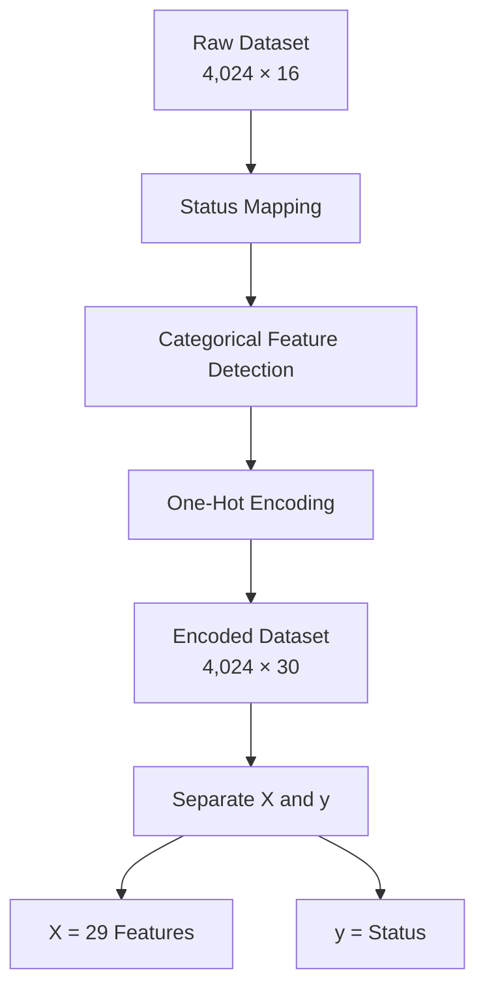
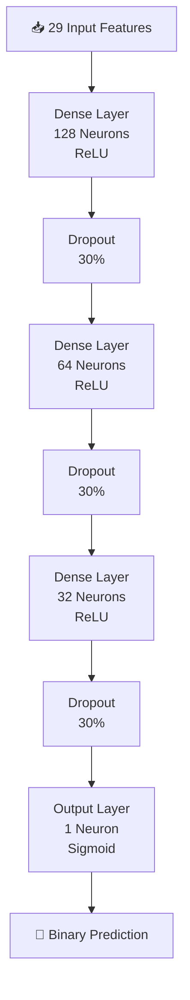
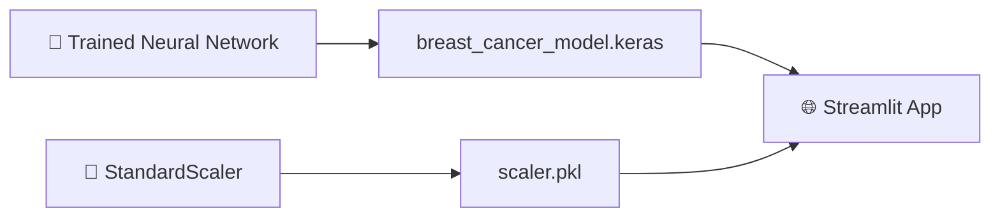
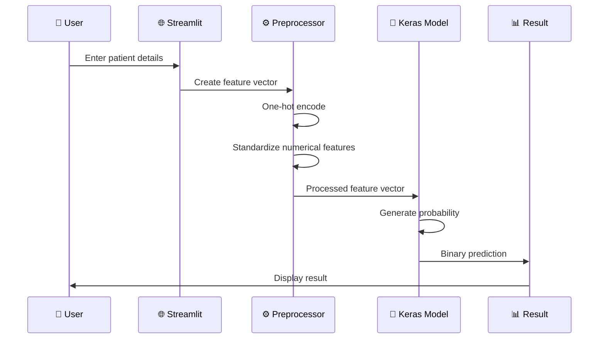

# 🎗️ Breast Cancer Status Predictor

### 🧠 Deep Learning • Healthcare Analytics • Streamlit

> **An end-to-end deep learning project that predicts breast cancer patient status from clinical and demographic features — packaged into an interactive Streamlit application.**

<p align="center">
  
  
  
  
  
  
</p>

<p align="center">
  <strong>📊 4,024 Patient Records</strong>
  &nbsp; • &nbsp;
  <strong>🧩 29 Model Features</strong>
  &nbsp; • &nbsp;
  <strong>🧠 14,209 Trainable Parameters</strong>
  &nbsp; • &nbsp;
  <strong>⚡ 50 Training Epochs</strong>
</p>

---

## 🌟 Overview

**Breast Cancer Status Predictor** is a machine learning application designed to learn patterns from structured breast cancer patient data and predict patient status as:

* 🟢 **Alive**
* 🔴 **Dead**

The project combines:

**Data Acquisition → Data Exploration → Feature Engineering → Encoding → Scaling → Neural Network Training → Model Serialization → Streamlit Deployment**

The dataset contains **4,024 records and 16 original columns**, including age, race, marital status, tumor stage, tumor size, lymph-node information, hormone-receptor status, survival months and patient status.

> ⚠️ **Medical Disclaimer:** This project is an educational machine-learning application. It is **not a medical diagnostic system** and must not be used as a substitute for professional medical advice, diagnosis, or treatment.

---

# 🚀 Project Pipeline

```mermaid
flowchart LR
    A[📦 Breast Cancer Dataset] --> B[🔍 Data Exploration]
    B --> C[🧹 Data Preprocessing]
    C --> D[🏷️ Target Encoding]
    D --> E[🔢 One-Hot Encoding]
    E --> F[✂️ Train / Test Split]
    F --> G[📏 Standard Scaling]
    G --> H[🧠 Deep Learning Model]
    H --> I[🎯 Model Training]
    I --> J[💾 Save Model + Scaler]
    J --> K[🌐 Streamlit Application]
    K --> L[👤 Patient Input]
    L --> M[🔮 Prediction]
```



---

# 🧬 Dataset

The project downloads the **Breast Cancer dataset** through KaggleHub and loads `Breast_Cancer.csv` using Pandas.

### 📊 Dataset Structure

| Category         | Features                                       |
| ---------------- | ---------------------------------------------- |
| 👤 Demographic   | Age, Race, Marital Status                      |
| 🎗️ Cancer Stage | T Stage, N Stage, 6th Stage, A Stage           |
| 🔬 Tumor         | Tumor Size, Grade, Differentiation             |
| 🧪 Biomarkers    | Estrogen Status, Progesterone Status           |
| 🧫 Lymph Nodes   | Regional Node Examined, Regional Node Positive |
| ⏳ Survival       | Survival Months                                |
| 🎯 Target        | Status                                         |

The original dataset contains **11 categorical features and 5 integer features**.

---

# ⚙️ Data Preprocessing

The target variable is transformed into a binary representation:

```text
Alive → 0
Dead  → 1
```

Categorical variables are then transformed using **one-hot encoding with `drop_first=True`**. This expands the original dataset from **16 columns to 30 columns**, including the target.

### 🔄 Feature Engineering Flow



---

# ✂️ Train / Test Split

The processed data is divided using an **80/20 split** with `random_state=42`.

```text
┌───────────────────────────────┐
│       4,024 Records           │
└───────────────┬───────────────┘
                │
        ┌───────┴───────┐
        ▼               ▼
   🧠 Training       🧪 Testing
   3,219 records      805 records
      80%               20%
```

The notebook records:

```text
X_train → (3219, 29)
X_test  → (805, 29)

y_train → (3219,)
y_test  → (805,)
```

---

# 📏 Feature Scaling

The numerical variables are standardized using **StandardScaler**.

### Numerical Features

```text
Age
Tumor Size
Regional Node Examined
Reginol Node Positive
Survival Months
```

The scaler is fitted on training data and then applied to the test data.

---

# 🧠 Deep Learning Architecture

The project uses a **TensorFlow/Keras Sequential Neural Network**.



### 🏗️ Architecture

| Layer       | Configuration      |
| ----------- | ------------------ |
| 📥 Input    | 29 features        |
| 🧠 Dense 1  | 128 neurons + ReLU |
| 🛡️ Dropout | 30%                |
| 🧠 Dense 2  | 64 neurons + ReLU  |
| 🛡️ Dropout | 30%                |
| 🧠 Dense 3  | 32 neurons + ReLU  |
| 🛡️ Dropout | 30%                |
| 🎯 Output   | 1 neuron + Sigmoid |

The model contains **14,209 trainable parameters**.

---

# 🎯 Training Configuration

```text
Optimizer        → Adam
Loss Function    → Binary Crossentropy
Metric           → Accuracy
Epochs           → 50
Batch Size       → 32
Validation Split → 20%
```

The model was trained for 50 epochs using Adam optimization and binary cross-entropy.

---

# 📈 Training Results

The notebook records the following result at the final epoch:

| Metric                 |   Epoch 50 |
| ---------------------- | ---------: |
| 🧠 Training Accuracy   | **92.35%** |
| 📉 Training Loss       | **0.2024** |
| 🧪 Validation Accuracy | **87.11%** |
| 📉 Validation Loss     | **0.4276** |

### 📌 Important

The notebook **does not report a final held-out test-set accuracy**, so no test accuracy is claimed here.

The training/validation gap also suggests that further regularization, early stopping, hyperparameter tuning, or alternative models could be explored.

---

# 💾 Model Export

After training, the project saves both the neural network and preprocessing scaler:

```text
breast_cancer_model.keras
scaler.pkl
```

The Keras model is saved using `model.save()`, while the scaler is serialized with Joblib.



---

# 🌐 Streamlit Application

The trained model is integrated into an interactive Streamlit interface.

The application provides:

### 👤 Patient Inputs

* Age
* Tumor Size
* Regional Nodes Examined
* Regional Nodes Positive
* Survival Months
* Race
* Marital Status
* T Stage
* N Stage
* 6th Stage
* Differentiation
* Histologic Grade
* A Stage
* Estrogen Status
* Progesterone Status

The notebook implements these inputs using Streamlit sliders and select boxes.

---

# 🔮 Prediction Workflow



The application uses a **0.5 probability threshold**:

```text
Probability ≤ 0.5 → Alive
Probability > 0.5 → Dead
```

---

# 🖥️ Application Experience

The Streamlit application includes:

```text
🎗️ Breast Cancer Status Predictor
        │
        ├── 📊 Patient Data Input
        │       ├── Numerical Features
        │       └── Categorical Features
        │
        ├── 🚀 Prediction Button
        │
        └── 🔮 Prediction Result
                ├── ✅ Alive
                └── ⚠️ Dead
```

## The UI includes custom CSS, a sidebar-based patient input section, prediction feedback, and a healthcare disclaimer.

# 🛠️ Tech Stack

| Technology                | Purpose                          |
| ------------------------- | -------------------------------- |
| 🐍 **Python**             | Core programming                 |
| 🐼 **Pandas**             | Data manipulation                |
| 🔢 **NumPy**              | Numerical processing             |
| 🤖 **TensorFlow / Keras** | Deep learning                    |
| 📐 **Scikit-learn**       | Data splitting & scaling         |
| 💾 **Joblib**             | Scaler serialization             |
| 🌐 **Streamlit**          | Interactive web application      |
| 🔗 **Pyngrok**            | Public tunnel during development |
| 📦 **KaggleHub**          | Dataset acquisition              |

---

# 📁 Suggested Repository Structure

```text
Breast-Cancer-Status-Predictor/
│
├── 📓 Breast_Cancer.ipynb
├── 🌐 app.py
├── 🧠 breast_cancer_model.keras
├── 📏 scaler.pkl
├── 📊 Breast_Cancer.csv
├── 📄 requirements.txt
├── 📜 README.md
└── 🖼️ assets/
    ├── architecture.png
    ├── workflow.png
    └── app-preview.png
```

---

# ⚡ Getting Started

## 1️⃣ Clone the Repository

```bash
git clone https://github.com/<your-username>/Breast-Cancer-Status-Predictor.git
cd Breast-Cancer-Status-Predictor
```

## 2️⃣ Install Dependencies

```bash
pip install pandas numpy scikit-learn tensorflow streamlit joblib kagglehub
```

Or create a `requirements.txt`:

```text
pandas
numpy
scikit-learn
tensorflow
streamlit
joblib
kagglehub
```

## 3️⃣ Run the Application

```bash
streamlit run app.py
```

The application will open locally at:

```text
http://localhost:8501
```

## The notebook also demonstrates running Streamlit through `pyngrok` for external access during development.

# 🧪 Example Workflow

```text
                 USER
                  │
                  ▼
        ┌──────────────────┐
        │ Patient Details  │
        └────────┬─────────┘
                 ▼
        ┌──────────────────┐
        │ Feature Encoding │
        └────────┬─────────┘
                 ▼
        ┌──────────────────┐
        │ Standard Scaling │
        └────────┬─────────┘
                 ▼
        ┌──────────────────┐
        │ Neural Network   │
        └────────┬─────────┘
                 ▼
        ┌──────────────────┐
        │ Probability      │
        └────────┬─────────┘
                 ▼
        ┌──────────────────┐
        │ 0.5 Threshold    │
        └────────┬─────────┘
             ┌───┴───┐
             ▼       ▼
          🟢 ALIVE  🔴 DEAD
```

---

# 📊 Project Highlights

```text
╭────────────────────────────────────────────╮
│              PROJECT SNAPSHOT              │
├────────────────────────────────────────────┤
│ 📊 Dataset Size              4,024 records │
│ 🧩 Original Features              16      │
│ 🔢 Model Features                29      │
│ 🧠 Trainable Parameters       14,209      │
│ ✂️ Training Samples            3,219      │
│ 🧪 Test Samples                  805      │
│ ⚡ Training Epochs                50      │
│ 🎯 Final Train Accuracy       92.35%      │
│ 📈 Final Val Accuracy         87.11%      │
│ 🌐 Deployment             Streamlit      │
╰────────────────────────────────────────────╯
```

---

# 🔬 Future Improvements

This project can be taken significantly further:

* [ ] 📊 Add confusion matrix
* [ ] 📈 Add precision, recall and F1-score
* [ ] 🎯 Evaluate on the held-out test set
* [ ] 🔍 Add ROC-AUC analysis
* [ ] 🧠 Compare Neural Network vs Random Forest / XGBoost / Logistic Regression
* [ ] ⚙️ Add hyperparameter tuning
* [ ] 🛑 Add EarlyStopping
* [ ] 📉 Improve validation performance
* [ ] 🧩 Save and reload the exact feature-column schema
* [ ] 🔐 Add robust input validation
* [ ] 🐳 Dockerize the Streamlit application
* [ ] ☁️ Deploy to Streamlit Cloud / another cloud platform
* [ ] 🧪 Add automated testing
* [ ] 📋 Add model explainability with SHAP
* [ ] 🔄 Build a reproducible preprocessing pipeline

---

# ⚠️ Limitations

### 1. Medical Use

This model is an **educational predictive system**, not a clinical diagnostic tool.

### 2. Evaluation

The notebook does not provide a final held-out test evaluation, so validation accuracy should not be interpreted as real-world clinical performance.

### 3. Feature Schema

The Streamlit implementation manually reconstructs the one-hot encoded feature vector. The notebook itself notes that a more robust implementation would save and reload the exact training feature-column order.

### 4. Model Generalization

The recorded training accuracy is higher than the final validation accuracy, indicating that further investigation into generalization and regularization would be valuable.

---

# 🎯 Learning Objectives

This project demonstrates an end-to-end workflow for:

```text
📥 Data Acquisition
       ↓
🔍 Data Understanding
       ↓
🧹 Data Preprocessing
       ↓
🔢 Feature Engineering
       ↓
📏 Feature Scaling
       ↓
🧠 Deep Learning
       ↓
📊 Model Training
       ↓
💾 Model Serialization
       ↓
🌐 Application Development
       ↓
🚀 Prediction Interface
```

---

# 🤝 Contributing

Contributions, improvements and experiments are welcome.

```bash
git checkout -b feature/your-feature
git add .
git commit -m "Add: your improvement"
git push origin feature/your-feature
```

Then open a Pull Request 🚀

---

# 📜 License

This project is intended for **educational and research purposes**.

Add an appropriate open-source license such as **MIT** before publishing the repository.

---

# 👨‍💻 Author

**Aravind**

> Building at the intersection of **AI × Software × Data × Real-World Problems**.

<p align="center">
  ⭐ If you found this project useful, consider giving it a star!
</p>

<p align="center">
  <strong>🎗️ Learn • Build • Experiment • Improve 🎗️</strong>
</p>
